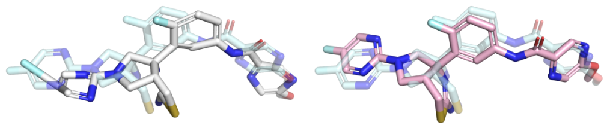

# Energy minimization post-processing used in PoseBusters

This code is based entirely on OpenMM's documentation:
- [OpenMM Python API](http://docs.openmm.org/latest/api-python/)
- [OpenMM User Guide](http://docs.openmm.org/latest/userguide/)
- [OpenMM User Guide on Energy Minimization](http://docs.openmm.org/7.2.0/userguide/application.html#energy-minimization)


### Example
Example of a ligand pose before and after energy minimisation. The pose before minimzation is shown in white, the optimised prediction is shown in pink, and the crystal ligand is shown as reference in light blue. Note how the aromatic rings are flattened and the leftmost bond is shortened by the optimisation. 

### Usage

#### Get script
```
git clone https://github.com/maabuu/posebusters_em.git
cd posebusters_em
```

#### Setup environment
```
conda create -n posebusters_em openff-forcefields openff-interchange openff-toolkit "openmm>=8" "openmmforcefields>=0.11" pdbfixer "rdkit>=2022" -c conda-forge
```

#### Run minimization
```
conda activate posebusters_em
python energy_minimization.py test_cases/7MYU_ZR7/7MYU_ZR7_protein.pdb test_cases/7MYU_ZR7/7MYU_ZR7_prediction.sdf 7MYU_ZR7_prediction_minimized.sdf -t cache_dir
```

This example takes ~2 minutes to run on a desktop computer. Depending on the system's complexity, runs may take much longer.


### Links
- [OpenMM User guide](http://docs.openmm.org/latest/userguide/)
- [PoseBusters tests](https://github.com/maabuu/posebusters)
- [PoseBusters paper](https://doi.org/10.1039/d3sc04185a)
